# MindStudio Kernel Performance Prediction 架构设计说明书

## 1. 概述

msKPP（MindStudio Kernel Performance Prediction），支持用户输入算子表达式，进而预测算子在这一算法实现下的性能上限。
msKPP是一款性能仿真工具，相较于cycle级仿真器，其仿真速度有数量级的提升。由于本身针对性能的预测不需要进行真实的计算，仅需要依据输入和输出的规模，给出对应算法的执行时间，故而，可以在秒级给出性能结果。

## 2. msKPP功能清单

### 2.1 建模

| 类型     | 功能清单                               | 功能描述                                                        | 支撑的系统功能                                       |
| -------- | -------------------------------------- | --------------------------------------------------------------- | ---------------------------------------------------- |
| 业务功能 | 算子搬运通路建模                       | 基于对算子各内存单元数据搬运通路进行建模                        | 算子性能建模->算子计算搬运规格分析->算子搬运指令建模 |
| 业务功能 | 算子随路转换建模                       | 支持自动转换计算特殊数据格式至目标存储单元特定数据格式          | 算子性能建模->算子计算搬运规格分析->算子搬运指令建模 |
| 业务功能 | Cache命中率建模                        | 支持对算子GM空间与vector core/cube core高带宽搬运通路命中率建模 | 算子性能建模->算子计算搬运规格分析->算子搬运指令建模 |
| 业务功能 | 支持tensor拆分                         | 支持tensor切片，模拟大tensor转换为小tensor                      | 算子性能建模->算子计算搬运规格分析->算子搬运指令建模 |
| 业务功能 | 支持pipe信息的理论值与msprof实测值比对 | 将建模数据与理论实测值比较                                      | 算子性能建模->算子计算搬运规格分析->算子搬运流水统计 |
| 业务功能 | 指令信息统计                           | 统计不同指令维度的总搬运数据量大小、操作数个数、耗时信息        | 算子性能建模->算子计算搬运规格分析->算子指令信息统计 |
| 业务功能 | 指令流水图                             | 通过trace可视化呈现算子执行各指令之间流水排布                   | 算子性能建模->算子计算搬运规格分析->算子指令流水     |
| 业务功能 | 指令占比饼图                           | 通过饼图可视化呈现算子执行各指令之间流水耗时占比                | 算子性能建模->算子计算搬运规格分析->算子指令占比     |
| DFX      | debug模式                              | 提供调试工具，帮助用户快速定位 DSL 语言中指令的出入队列问题，提供工具定位效率   | 算子性能建模->指令流水->指令调度分析                 |
| DFX      | 性能数据补充                           | 支持对用户自定义指令补充性能数据                                | 算子性能建模->指令流水->指令补充                     |

### 2.2 自动寻优

**功能清单以表格形式输出**

| 类型     | 功能清单                                   | 功能描述                                                                                                             | 支撑的系统功能                        |
| -------- | ------------------------------------------ | -------------------------------------------------------------------------------------------------------------------- | ------------------------------------- |
| 业务功能 | 支持算子下发代码的自动生成并提供Python接口 | 提供Python接口，支持模板库算子下发C++代码的生成；生成的下发代码支持被Python导入扩展，支持开发者在Python进行算子下发  | msKPP支持模板库的编译运行自动化       |
| 业务功能 | 支持模板库的自动编译能力                   | 提供Python接口，使用内置编译选项模板或开发者输入自定义编译选项，支持模板库算子的编译                                 | msKPP支持模板库的编译运行自动化       |
| 业务功能 | 支持下发代码自动编译                       | 提供Python接口，对自动生成的算子下发代码完成编译，实现算子下发功能；                                                 | msKPP支持模板库的编译运行自动化       |
| 业务功能 | 支持接入kernel性能度量的能力               | 支持使用调优工具的接口对用msKPP进行下发的算子进行耗时数据的采集                                                      | msKPP支持模板库的编译运行自动化       |
| 业务功能 | 支持算子工具接入并协同使用                 | 其他算子工具拉起msKPP算子运行脚本，功能正常                                                                          | msKPP支持模板库的编译运行自动化       |
| 业务功能 | 支持指定可调参数的自动替换                 | 支持模板代码自动变更，并与编译模块协同，实现代码的实例化；支持kv格式的输入，并能正确地匹配到模板库中标识的可调变量上 | msKPP与模板库协同实现模板参数自动变更 |
| 业务功能 | 支持msopgen工程的轻量化调度                 | 支持msopgen工程tiling函数调用代码生成、编译、运行，支持kernel函数下发代码生成、编译、运行 | msKPP支持msopgen工程的编译运行自动化 |

## 3. 软件实现设计目标分析与关键要素设计

### 3.1 整体设计目标分析

1、代码易扩展：算子性能建模依赖已有的指令性能数据，昇腾基础指令上百种。如果方便用户扩展指令，以便对使用该指令的算子进行建模，提供开放易用的指令注册功能是一个关键目标。还应提供标准的tiling函数与kernel函数的下发代码生成、编译、运行能力，以方便面向不同算子工程易扩展。

2、数据一致性：算子性能建模依赖对不同指令在不同流水上耗时计算，需要有机制保障搬运类和计算类不同指令一致计算，指令扩展时保障数据流归一；

3、调度低延时：性能建模提供对外的DSL语言模拟算子，在建模过程中会计算大量指令，指令调度与计算耗时影响算子建模易用性，需考虑跨语言调用更快速地调度算法；

### 3.2 关键要素设计

| 关键要素 | 设计目标                                                                                                                                            |
| -------- | --------------------------------------------------------------------------------------------------------------------------------------------------- |
| 实现模型 | 代码易扩展：算子在不同芯片平台建模依赖大量基础指令，指令调度时需要支持对不同指令数据的自主注册。                                                    |
| 交互模型 | 数据一致性：算子性能建模依赖对不同指令在不同流水上耗时计算，需要有机制保障搬运类和计算类不同指令一致计算，指令扩展时保障数据流归一。                |
| 并发模型 | 查询高并发：性能建模提供对外的DSL语言模拟算子，在建模过程中会计算大量指令，指令调度与计算耗时影响算子建模易用性，需考虑跨语言调用更快速地调度算法。 |

## 4.开发视图

### 4.1 实现模型

#### 4.1.1性能建模

##### 4.1.1.1 概述

指令集拆解：将DSL语言拆解为统一的指令集和调度任务。

指令调度：模拟芯片行为对输入指令进行统一调度，得到不同指令的调度耗时和起止时间。

数据解析：根据指令调度的结果生成不同维度的指令分析数据，如指令耗时统计、指令流水等。

##### 4.1.1.2 上下文视图

如下图所示，msKPP通过提供一系列指令接口a给外部用户A，用以实现对算子的性能建模。

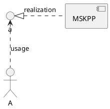

##### 4.1.1.3 逻辑视图

msKPP主要逻辑是：INSTR_TASK模块对外部指令进行拆解并形成指令调度任务，INSTR_SCHEDULE指令调度系统接收指令任务和已有的性能
数据PROF_DATA，在指令调度结束后进行记录并分别生成TRACE流水和性能数据METRICS。

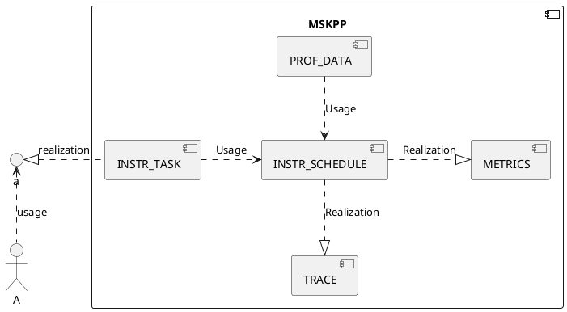

软件单元清单汇总表：

| 软件单元       | 描述                       | 外部接口              | 内部接口     | 关系描述                                           |
| -------------- | -------------------------- | --------------------- | ------------ | -------------------------------------------------- |
| INSTR_TASK     | 指令任务创建模块，内部实现 | Tensor、Chip、Core指令 | RawTask      | 拆解外部输入指令，形成指令任务集                   |
| INSTR_SCHEDULE | 指令调度模块，内部实现     |                       | add_task、run | 添加拆解的任务形成任务队列，并模拟芯片行为调度指令 |
| PROF_DATA      | 指令性能数据计算，内部实现 |                       | prof_data    | 根据指令类型加载不同指令的计算结果                 |
| TRACE          | 指令流水图，内部实现       |                       | Trace        | 根据指令调度结果，生成指令流水图                   |
| METRICS        | 指令性能数据，内部实现     |                       | Metrics      | 根据指令调度结果，生成多种指令性能数据             |

##### 4.1.1.4 软件实现单元设计

根据软件单元清单汇总表，msKPP涉及的主要软件模块单元为指令任务创建模块（INSTR_TASK）、指令任务调度模块（INSTR_SCHEDULE）、指令任务性能数据
计算模块（PROF_DATA）、msKPP性能数据解析模块（TRACE和METRICS）。其中指令任务调度的模块涉及可参见算法实现章节。msKPP性能数据解析模块主要功能
是对调度指令进行记录分别生成可视化的指令流水trace.json和统计图表格，可作为基础公共方法。本章节主要针对指令任务创建模块、指令任务性能数据计算模块展示
静态结构框图。

INSTR_TASK指令任务创建模块静态结构框图，其中指令任务包括计算指令ComputationInstruction和搬运类指令MemoryInstruction，其中计算类指令采用工厂模式进行
注册：

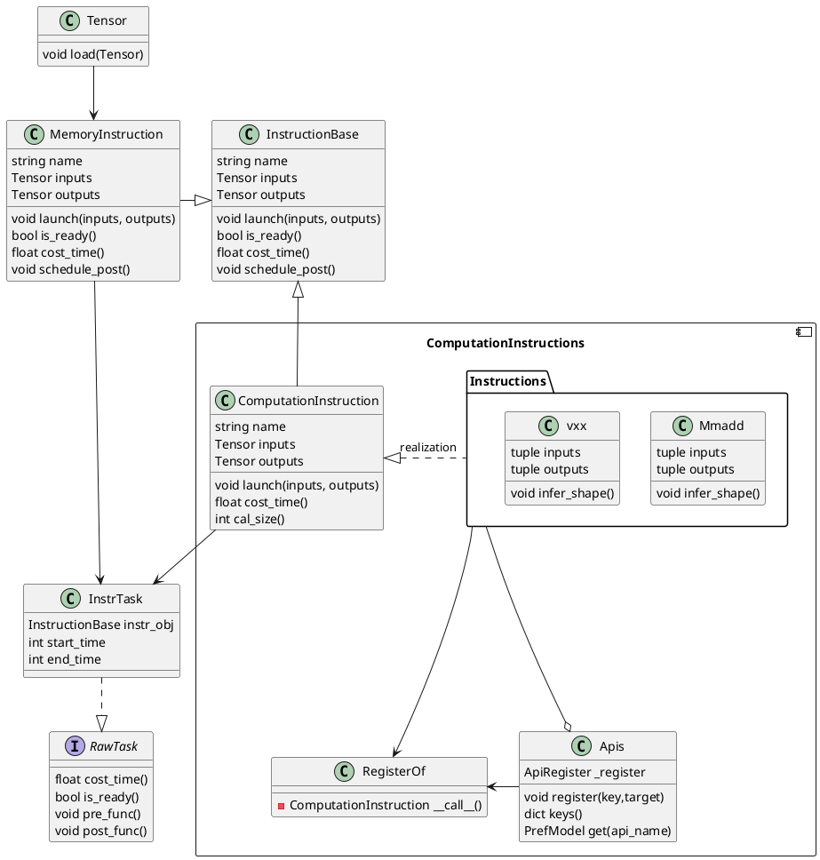

PROF_DATA指令性能数据计算模块静态结构图，其中Instructions_Data组件为C++侧提供的数据计算接口：

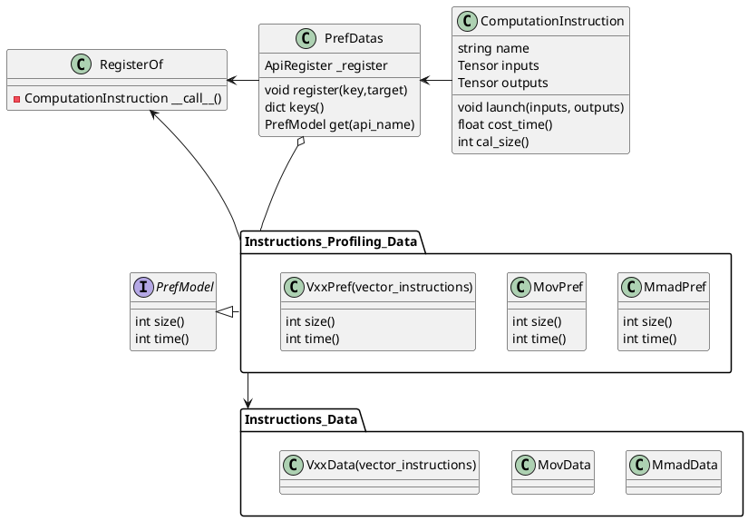

在C++侧Instructions_Data类图实现如下：

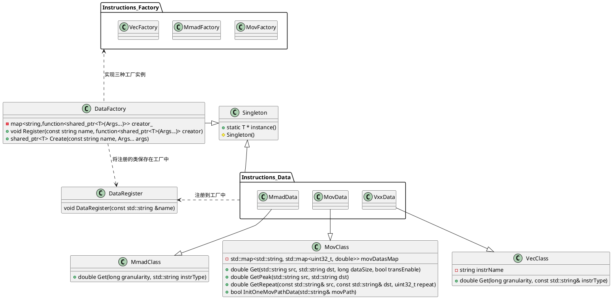

#### 4.1.2 自动寻优

##### 4.1.2.1 概述

msKPP算子自动寻优模块，主要提供：模板库算子的下发代码生成、自动编译、真实运行、自动寻优等功能，使开发者仅需输入算子代码路径与需测试的kernel名，免去了自行实现算子接入适配的工作，直接通过Python接口完成算子上板运行与参数寻优自动化。

实现元素功能描述：

1. 自动生成算子下发代码，提供Python接口；
2. 自动生成编译脚本并完成编译；
3. 动态调用算子下发接口，支持接入性能度量与其他算子工具；
4. 支持模板库参数自动寻优；

根据上述功能实现分解出4个软件实现子模块，同时额外增加一个子模块用于接收用户输入信息，并生成配置对象供各其他子模块使用：

* 代码生成子模块
* 编译子模块
* 运行子模块
* 自动寻优子模块
* 测试对象配置子模块

actor角色描述：

* 算子开发者：通过msKPP提供的API实现模板库算子快速上板测试验证。

##### 4.1.2.2 上下文视图

msKPP自动寻优功能对外向开发者提供Python接口，其部署在CANN包中，依赖如下组件：

1. runtime，运行时库实现算子下发；
2. AscendCL，设备上下文管理；
3. bisheng编译器，代码编译；
4. mspti， 性能数据采集。

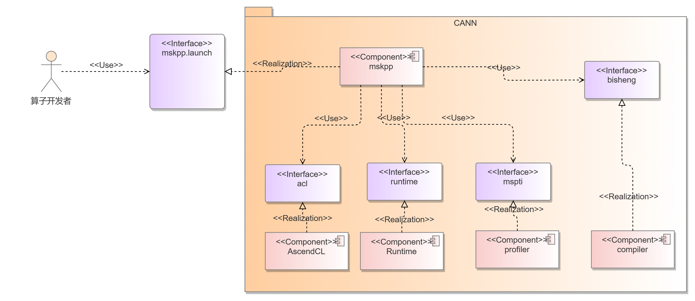

##### 4.1.2.3 逻辑视图

子模块分别对外提供以下接口：

1. 代码生成，生成算子下发代码。
2. 编译，编译下发与算子代码，生成可执行的算子运行二进制。
3. 运行，供开发者传入算子入参并实现流创建、设备管理与算子下发。
4. 自动寻优，在定义的搜索空间中寻找到性能最优的参数组合。
5. 上下文，在以上模块间保存输入输出上下文，供模块间相互使用。

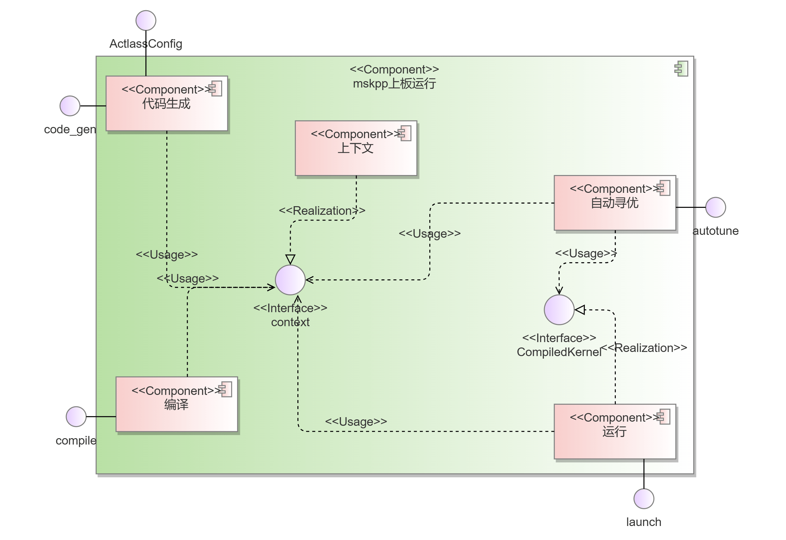

软件单元清单：

| 软件单元 | 描述                                             | 外部接口  | 内部接口 | 关系描述                                                                                 |
| -------- | ------------------------------------------------ | --------- | -------- | ---------------------------------------------------------------------------------------- |
| 代码生成 | 生成算子下发代码                                 | code\_gen | /        | 实现code\_gen接口，供外部与自动寻优模块使用，更新上下文模块                              |
| 编译     | 编译下发与算子代码，生成可执行的二进制           | compile   | /        | 实现compile接口，供外部与自动寻优模块使用，更新上下文模块                                |
| 运行     | 实现流创建、设备管理与算子下发                   | launch    | /        | 实现launch接口，供外部与自动寻优模块使用，更新上下文模块                                 |
| 自动寻优 | 搜索空间中寻找到性能最优的参数组合               | autotune  | /        | 实现autotune接口，供外部使用，利用上下文模块获取算子信息，并调用代码生成、编译、运行接口 |
| 上下文   | 在以上模块间保存输入输出上下文，供模块间相互使用 | context   | /        | 保存上下文信息，供其他模块使用                                                           |

##### 4.1.2.4 软件实现单元设计

代码生成子模块静态结构框图，
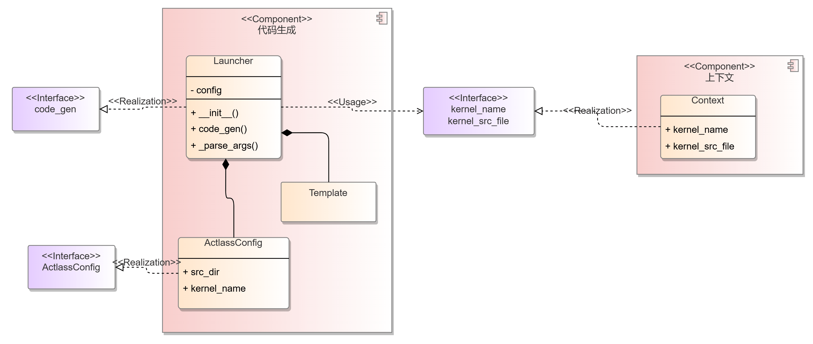

编译与运行模块静态结构框图，
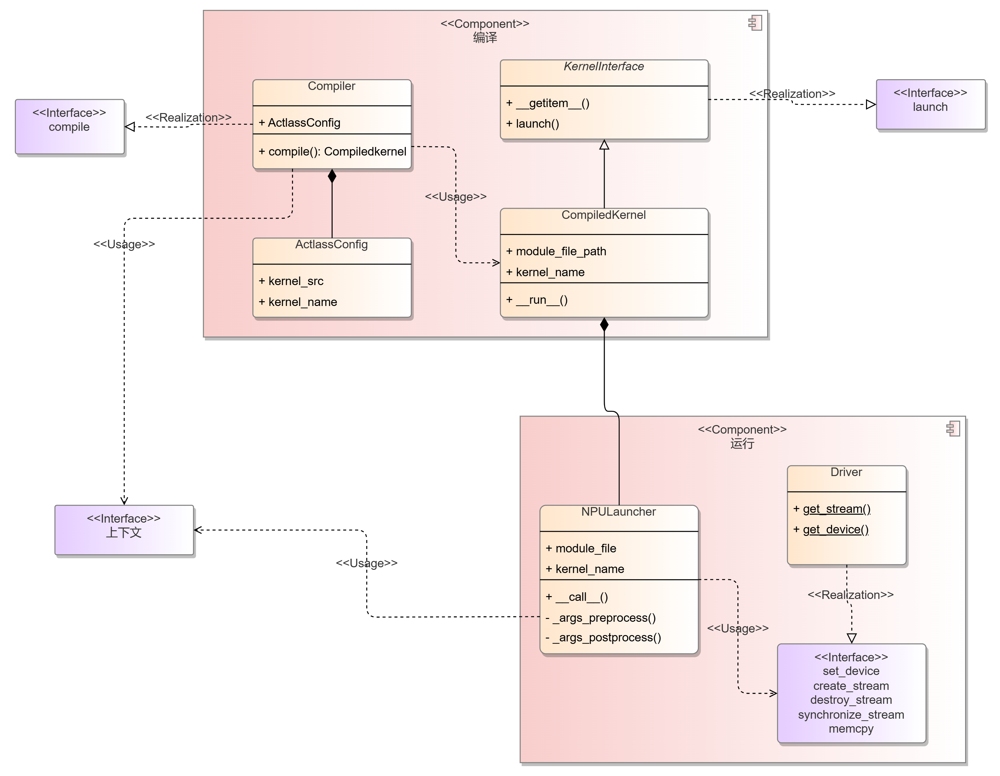

### 4.2 接口

#### 4.2.1 性能建模

##### 4.2.1.1 总体设计

msKPP提供简便易用的DSL语言帮助用户快速构建自己的算子实现方案，DSL以一系列接口进行呈现，主要分为基础功能接口和特定指令接口。

基础功能接口用以模拟算子计算中依赖的芯片平台、基础数据等；特定指令接口便于模拟特定的算子指令操作，包括vector类计算类指令和cube类计算指令。

接口面向kpp内部用以接收算子计算作用域、算子搬运类指令和计算类指令的输入。

##### 4.2.1.2 设计目标

1、msKPP对外提供接口应保持职责单一，不同接口承担单独的算子行为；

2、为承接用户对不同的指令建模诉求，接口设计应便捷可扩展；

3、其中对于高度同质化接口，应具备高度抽象并易于复用；

4、接口定义具备可测试性；

##### 4.2.1.3 设计约束

msKPP-DSL语言由于只关心算子性能，因此建模思路中虚拟构建的tensor只关心其数据大小，内部并没有任何真实数据也没有实际上的空间占用。

指令调优数据作为高频次调用接口，应具备高可靠、低时延的特点快速计算指令性能指标数据。从安全性上，KPP接口应具备足够的冗余度，对不同的输入情况进行处理，既对正常输入执行，对异常输入报错提示；

##### 4.2.1.4 技术选型

不涉及。

##### 4.2.1.5 基于C++构建的调度与性能数据计算单元

KPP本身提供基于Python的DSL语言，而在实际使用中，算子行为模拟指令数规模较大，难以实现性能目标。为加速其中指定调度和数据计算环节，对其进行C++化并以接口方式向Python侧提供。

1. 接口描述

    指令调度单元：指令调度单元的核心功能是接收外部指令数据，按照芯片行为进行建模调度，生成指令的调度起止时间；

    ```Python
    # 指令调度不断添加指令任务后，统一触发调度任务
    for i in range("指令数目"):
        task_schedule.add_task(task)
    duration = task_schedule.run()
    ```

    性能数据处理单元：当指令调度之前，需要依赖当前指令的性能数据作为指令任务共同提供给指令调度；

    ```Python
    # 以Vadd指令为例,通过性能数据计算模块获取vadd指令的调度耗时
    def time(self):
        real_perf = prof_data.VaddData().get(tile_size, instr_type)
        cycles = ceil(dtype_size * tile_size / real_perf)
        return cycles

    def cost_time(self):
        return PrefDatas.get("Vadd")(inputs, outputs).time()
    ```

2. 接口信息模型

    指令调度单元：

    ```Python
    self.name = instr_obj.task_name # 调度任务名称
    self.owner = pipe_name          # 指令归属pipe名称
    self.instr_obj = instr_obj      # 调度指令对象
    self.start_time = 0             # 指令任务开始时间
    self.end_time = 0               # 指令任务结束时间
    ```

3. 接口清单

    ```text
    接口名：cost_time
    接口功能：根据已有的性能数据计算出指令调度耗时。
    接口类型/协议：Python接口/C++接口。
    接口方向：
    输入参数名：无。
    输出参数名：无。
    返回值：成功时返回指令调度耗时，失败时返回0。
    注意事项：无。

    接口名：size
    接口功能：返回调度指令的size大小。
    接口类型/协议：Python接口/C++接口。
    接口方向：
    输入参数名：无。
    输出参数名：无。
    返回值：成功时返回指令size大小，失败时返回0。
    注意事项：无。

    接口名：is_ready
    接口功能：返回调度指令前对指令是否就绪的判断。
    接口类型/协议：Python接口/C++接口。
    接口方向：
    输入参数名：无。
    输出参数名：无。
    返回值：成功时返回指令就绪的状态，失败时返回true。
    注意事项：无。

    接口名：post_func
    接口功能：调度指令后进行的操作，包括trace记录，性能数据收集，传递tensor有效性。
    接口类型/协议：Python接口/C++接口。
    接口方向：
    输入参数名：无。
    输出参数名：无。
    返回值：成功时指令完成相应操作，失败时操作无效，有消息传递中断。
    注意事项：无。

    接口名：xxxData（一类接口的命名范式，包含搬运类指令、cube计算类指令和vector计算类指令）
    接口功能：创建指令调度任务前，需要集成该条指令的总耗时，本接口收集已有的性能数据并返回计算结果。
    接口类型/协议：C++接口。
    接口方向：
    输入参数名：对于搬运类指令，需要输入指令的起始内存单元、数据大小、通路转换标识。对于计算类指令需要输入数据规模、数据类型。
    输出参数名：无。
    返回值：成功时返回指令的计算耗时，失败返回空。
    注意事项：无。
    ```

#### 4.2.2 自动寻优

##### 4.2.2.1 总体目标

msKPP以Python库的形式提供代码生成、编译、运行等基础功能，自动寻优特性组合基础功能来实现，接口因依赖CANN，需与性能建模的接口隔离。

##### 4.2.2.2 设计目标

外部接口直接面向开发者，接口按照功能划分，应清晰定义接口提供的功能范围，同时为应对未来可能扩展的场景预留灵活可扩展的参数。
内部子模块间的接口应尽量简洁、减少依赖。

##### 4.2.2.3 设计约束

子模块间输入输出关系分析如下，接口的输入输出参数设计需满足图中的约束。

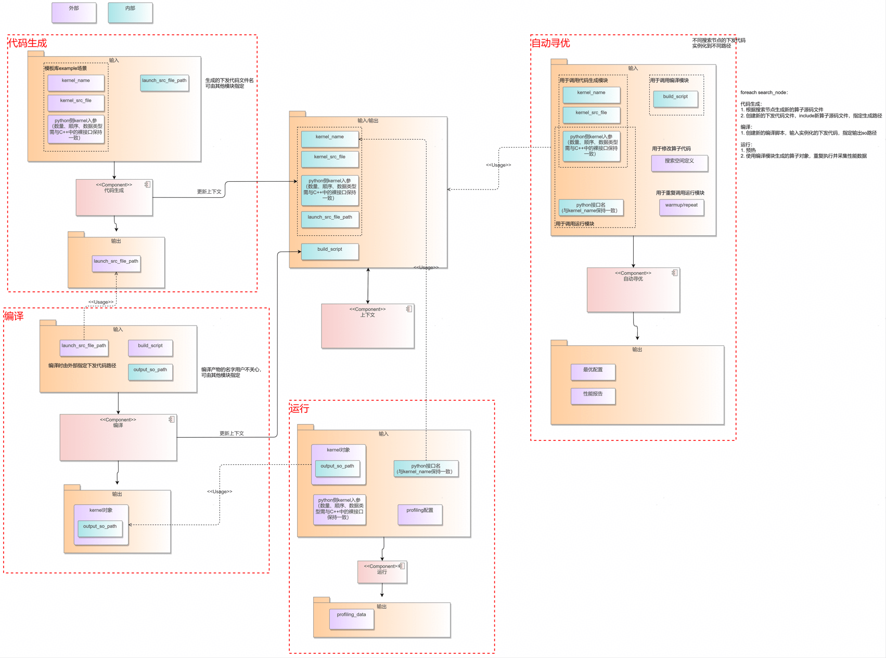

##### 4.2.2.4 技术选型

接口界面设计如下图所示，

方案一：

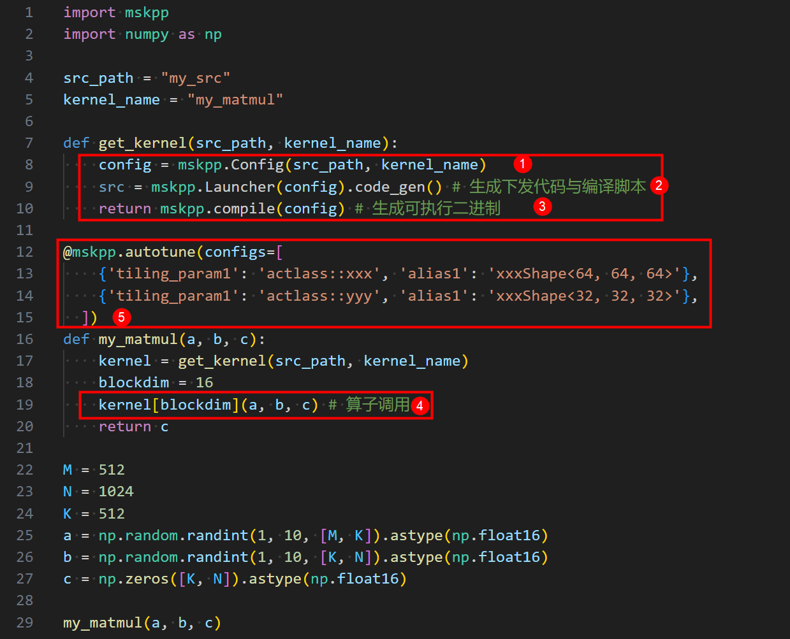

1. 配置kernel信息
2. 生成kernel下发代码
3. 编译kernel下发代码与kernel
4. 进行kernel调用
5. 配置自动寻优

方案二：
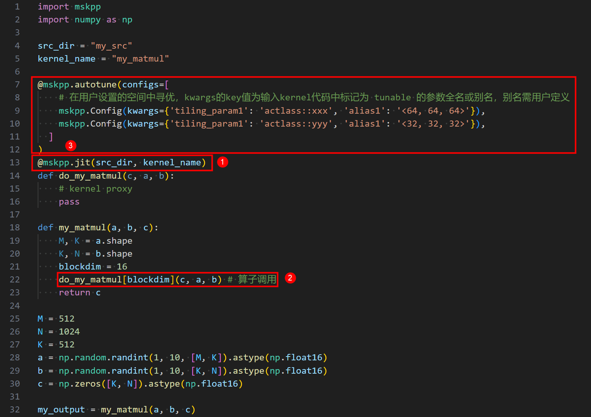

1. 配置kernel信息
2. 进行kernel调用
3. 配置自动寻优

方案2接口暴露较少，配置、编译、代码生成功能融合未原子化提供，且jit命令与实际功能描述不符，架构上对jit功能点未来还有其他的考量，此次选择方案1设计接口。

##### 4.2.2.5 软件单元--代码生成子模块

代码生成子模块中，外部输入为结构体对象与场景关联，将其传入Launcher的构造函数构造当前场景的代码生成器。当需要向其他可能的场景扩展时，扩展定义新的结构体传入Launcher构造不同场景的代码生成器对象即可，代码生成接口无需变更。

模板库场景：`KernelInvokeConfig`

```Python
class KernelInvokeConfig:
    """
    A configuration descriptor for a possible kernel developed based on an Act example
    """

    def __init__(self, kernel_src_file, kernel_name):
        pass
```

自定义算子工程Tiling调用场景：`TilingConfig`

```Python
class TilingConfig:
    def __init__(self, op_type: str, inputs: list, outputs: list, lib_path: str = None,
                 inputs_info: list = None, outputs_info: list = None, attr=None, soc_version: str = None):
        pass
```

自定义算子工程kernel调用场景：`KernelBinaryInvokeConfig`

```Python
class KernelBinaryInvokeConfig:
    def __init__(self, kernel_binary_file: str, kernel_type: str = None, tiling_key: int = None):
        pass
```

---

code_gen

功能说明：根据输入的模板库kernel信息，生成Kernel下发代码。

函数原型：gen_file = mskpp.Launcher(config).code_gen()

参数说明：

| 参数名   | 数据类型 | 必选 | 说明                                                        |
| -------- | -------- | ---- | ----------------------------------------------------------- |
| gen_file | str      | Y    | 指定生成Kernel侧下发代码的文件路径。默认值为_gen_launch.cpp |

返回值说明：生成代码的文件路径。

调用示例：

```Python
config = mskpp.KernelInvokeConfig(src_path, kernel_name)
gen_file = mskpp.Launcher(config).code_gen()
```

备注：相关类/结构体定义：

```Python
class Launcher:

    def __init__(self, config: KernelInvokeConfig):
        """
        a class that generates launch source code for a kernel

        Args:
            config (KernelInvokeConfig): An configuration descriptor for a kernel
        """
        pass

    def code_gen(self, gen_file: str = "_gen_launch.cpp"):
        """
        Generate launch source code (glue code) for a kernel.
        Support the following launch mode: 1. kernel invocation <<<>>>

        Args:
            gen_file (str, optional): Specify the generated launch source code file path for kernel.
                                      Defaults to "_gen_launch.cpp".

        Returns:
            str: The file path of generated launch source file.

        Note:
        """
```

---

tiling_func

功能说明：输入算子Tiling函数信息，实现Tiling函数调用代码生成、编译、运行。

函数原型：

```python
def tiling_func(op_type: str, inputs: list, outputs: list, lib_path: str = None,
                inputs_info: list = None, outputs_info: list = None, attr=None,
                soc_version: str = None) -> TilingOutput:
```

参数说明：

| 参数名   | 数据类型 | 必选 | 说明                                                        |
| -------- | -------- | ---- | ----------------------------------------------------------- |
| op_type| str      | Y    | 算子名 |
| inputs | list      | Y    | 算子输入tensor列表 |
| outputs | str      | Y    | 算子输出tensor列表 |
| inputs_info| str      | N    | 算子输入tensor详细信息 |
| outputs_info| str      | N    | 算子输出tensor详细信息 |
| attr | str      | N   | 算子Tiling属性 |
| lib_path | str      | N    | 算子Tiling函数所在动态库 |
| soc_version | str      | N    | 算子运行硬件平台信息 |

返回值说明：TilingOutput

调用示例：

```Python
config = mskpp.KernelInvokeConfig(src_path, kernel_name)
gen_file = mskpp.Launcher(config).code_gen()

tiling_output = mskpp.tiling_func(
    op_type="MatmulLeakyreluCustom",
    inputs_info=inputs_info, outputs_info=outputs_info,
    inputs=[input_a, input_b, input_bias], outputs=[output],
    attr=attr, # 可选
    lib_path="./build_out/_CPack_Packages/Linux/External/custom_opp_ubuntu_aarch64.run/packages/vendors/customize/op_impl/ai_core/tbe/op_tiling/liboptiling.so",  # 可选，tiling代码编译产物
    # soc_version="", # 可选
)
blockdim = tiling_output.blockdim
workspace_size = tiling_output.workspace_size
tiling_data = tiling_output.tiling_data # 以 numpy array类型返回
workspace = np.zeros(workspace_size).astype(np.uint8) # workspace需要用户自行申请
```

备注：相关类/结构体定义：

```Python
class TilingOutput:
    def __init__(self, tiling_output: dict):
        self.blockdim = tiling_output["blockdim"]
        self.workspace_size = tiling_output["workspace_size"]
        self.tiling_data = np.array(tiling_output["tiling_data"], dtype=np.uint8)
        self.tiling_key = tiling_output["tiling_key"]
```

---

get_kernel_from_binary

功能说明：输入算子二进制路径等信息，实现kernel函数调用代码生成、编译、运行。

函数原型：

```python
def get_kernel_from_binary(kernel_binary_file: str, kernel_type: str = None, tiling_key: int = None) -> CompiledKernel:
```

参数说明：

| 参数名   | 数据类型 | 必选 | 说明                                                        |
| -------- | -------- | ---- | ----------------------------------------------------------- |
| kernel_binary_file| str      | Y    | 算子.o文件路径 |
| kernel_type| str      | N    | 算子类型 |
| tiling_key| int      | N    | 算子Tilingkey |

返回值说明：CompiledKernel

调用示例：

```Python
# This function's input arguments must exactly match the kernel function.
def run_kernel(input_a, input_b, input_bias, output, workspace, tiling_data):
    kernel_binary_file = "MatmulLeakyreluCustom_97ef75830e63ebe749e7c029d8d403c5.o"
    kernel = mskpp.get_kernel_from_binary(kernel_binary_file)
    return kernel(input_a, input_b, input_bias, output, workspace, tiling_data, device_id=1)
```

##### 4.2.2.6 软件单元--编译子模块

compile

功能说明：编译kernel下发代码，返回一个可执行的kernel对象。

函数原型：`kernel = compile(build_script, gen_file)`

参数说明：

| 参数名          | 数据类型 | 必选 | 说明                                                               |
| --------------- | -------- | ---- | ------------------------------------------------------------------ |
| build_script    | str      | Y    | 用于模板库Kernel编译的脚本。              |
| gen_file        | str      | Y    | Kernel下发代码文件路径，一般直接使用code_gen接口返回值。           |
| output_bin_path | str      | N    | 指定编译生成的可执行文件路径。默认值：_gen_module.so。             |
| use_cache       | bool     | N    | 开启后不执行编译，加载output_bin_path所指定的文件。默认值：False。 |

返回值说明：CompiledKernel对象，如下方式调用kernel：kernel[blockdim](arg1, arg2, ...)。

调用示例：

```Python
kernel = compile(build_script, gen_file)
kernel[blockdim](arg1, arg2, ...) # 算子调用
```

备注：相关类/结构体定义：

````Python
class KernelInterface(Generic[T]):
    """
    Kernel interface class, providing a way to launch function in the form: kernel[blockdim](x, y, z)
    """
    launch: T

    def __getitem__(self, blockdim) -> T:
        return lambda *args, **kwargs: self.launch(blockdim=blockdim, *args, **kwargs)

class CompiledKernel(KernelInterface[T]):
    """
    Object class representing a kernel, provides an interface to launching kernel.
    Support kernel invocation in form of "kernel[blockdim](a, b, c)".
    """
    def __init__(self, output_bin_path, kernel_name):
        self.module_path = output_bin_path
        self.kernel_name = kernel_name
        self.__run__ = Launcher(self.module_path)

    def launch(self, *args, blockdim, **kwargs):
        pass
````

---

compile_executable

功能说明：编译kernel下发代码，返回一个可执行的kernel对象。

函数原型：`executable = compile_executable(build_script, src_file)`

参数说明：

| 参数名          | 数据类型 | 必选 | 说明                                                               |
| --------------- | -------- | ---- | ------------------------------------------------------------------ |
| build_script    | str      | Y    | 用于编译被调优应用的脚本文件路径。              |
| gen_file        | str      | Y    | 代码文件路径。           |
| output_bin_path | str      | N    | 指定编译生成的可执行文件路径，默认值：_gen_executable。             |
| use_cache       | bool     | N    | 开启后不执行编译，加载output_bin_path所指定的文件。默认值：False。 |
| profiling_cmd       | str     | N    | 预留参数，填入msprof op命令。 |

返回值说明：可执行程序对象executable，类型：CompiledExecutable，支持如下方式调用：executable(arg1, arg2, ...)，其中arg1、args2、...是程序自定义入参。

调用示例：

```Python
executable = compile_executable(build_script, src_file)
executable(a, b, c)
```

备注：相关类/结构体定义：

````Python
class CompiledExecutable:
       """
       Object class representing an executable file, provides an interface to execute itself in subprocess.
       """
       def __init__(self, _executable_path: str):
           pass

       def __call__(self, *args, **kwargs):
           return self._launch(*args, **kwargs)

       def _launch(self, *args, **kwargs):
           pass
````

---

compile_tiling

功能说明：编译tiling调用代码，返回一个可执行的tiling函数。

函数原型：tiling_func = compile_tiling(gen_file)

参数说明：

| 参数名          | 数据类型 | 必选 | 说明                                                               |
| --------------- | -------- | ---- | ------------------------------------------------------------------ |
| gen_file        | str      | Y    | tiling调用代码文件路径，一般直接使用code_gen接口返回值。           |

返回值说明：tiling函数。

调用示例：

```Python
run_tiling_func = compile_tiling(gen_file)
tiling_output = run_tiling_func() # tiling调用
```

compile_kernel_binary

功能说明：编译tiling调用代码，返回一个可执行的tiling函数。

函数原型：tiling_func = compile_tiling(gen_file)

参数说明：

| 参数名          | 数据类型 | 必选 | 说明                                                               |
| --------------- | -------- | ---- | ------------------------------------------------------------------ |
| gen_file        | str      | Y    | tiling调用代码文件路径，一般直接使用code_gen接口返回值。           |

返回值说明：tiling函数。

调用示例：

```Python
run_tiling_func = compile_tiling(gen_file)
tiling_output = run_tiling_func() # tiling调用
```

##### 4.2.2.7 软件单元--自动寻优子模块

autotune：

功能说明：以kernel函数为对象，遍历搜索空间内的config，反复运行kernel函数获得每项config的耗时，识别最优参数集。

函数原型：`def autotune(configs: List[Dict], warmup: int = 300, repeat: int = 1, device_ids=[0])`

参数说明：

| 参数名     | 数据类型   | 必选 | 说明                                                                                                |
| ---------- | ---------- | ---- | --------------------------------------------------------------------------------------------------- |
| configs    | list[dict] | Y    | 搜索空间定义，key-value格式，寻优时会用value值替换kernel代码中被 // tunable 标记的key值对应代码行。 |
| warmup     | int        | N    | 采集性能前的设备预热时间。单位：us。默认值：300us。                                                 |
| repeat     | int        | N    | 重放次数，会根据多次重放取运行耗时的平均值作为算子耗时。默认值：1。                                 |
| device_ids | list[int]  | N    | device id列表，目前仅支持单device模式，如果填写多个device id，只有第一个会生效功能。默认值：[0]。 |

返回值说明：无

备注：

调用示例：

```Python
@mskpp.autotune(configs=[
    {'L1TileShape': 'MatmulShape<64, 64, 64>', 'L0Shape': 'MatmulShape<128, 256, 64>'},
    {'L1TileShape': 'MatmulShape<64, 64, 128>', 'L0Shape': 'MatmulShape<128, 256, 64>'},
    {'L1TileShape': 'MatmulShape<64, 128, 128>', 'L0Shape': 'MatmulShape<128, 256, 64>'},
    {'L1TileShape': 'MatmulShape<64, 128, 128>', 'L0Shape': 'MatmulShape<64, 256, 64>'},
    {'L1TileShape': 'MatmulShape<128, 128, 128>', 'L0Shape': 'MatmulShape<128, 256, 64>'},
], warmup=500, repeat=10, device_ids=[0])
def basic_matmul(problem_shape, a, layout_a, b, layout_b, c, layout_c):
    kernel = get_kernel()
    blockdim = 20
    return kernel[blockdim](problem_shape, a, layout_a, b, layout_b, c, layout_c)
```

---

autotune_v2：

功能说明：以算子应用为对象，遍历搜索空间内的config，反复运行完整的算子程序获得每项config的耗时，识别最优参数集。

函数原型：`def autotune_v2(configs: list, warmup_times: int = 5)`

参数说明：

| 参数名     | 数据类型   | 必选 | 说明                                                                                                |
| ---------- | ---------- | ---- | --------------------------------------------------------------------------------------------------- |
| configs    | list[dict] | Y    | 搜索空间定义，key-value格式，寻优时会用value值替换kernel代码中被 // tunable 标记的key值对应代码行。 |
| warmup_times     | int        | N    | 采集性能前的设备预热次数。默认值：5。                                                 |

返回值说明：无

调用示例：

```Python
@mskpp.autotune_v2(configs=[
    {'L1TileShape': 'GemmShape<128, 256, 256>', 'L0TileShape': 'GemmShape<128, 256, 64>'},
    {'L1TileShape': 'GemmShape<256, 128, 256>', 'L0TileShape': 'GemmShape<256, 128, 64>'},
    {'L1TileShape': 'GemmShape<128, 128, 256>', 'L0TileShape': 'GemmShape<128, 128, 64>'},
    {'L1TileShape': 'GemmShape<128, 128, 512>', 'L0TileShape': 'GemmShape<128, 128, 64>'},
    {'L1TileShape': 'GemmShape<64, 256, 128>', 'L0TileShape': 'GemmShape<64, 256, 64>'},
], warmup_times=10)
def run_executable(m, n, k, device_id):
    src_file = "./basic_matmul.cpp"
    build_script = "./jit_build_executable.sh" # executable compile script
    executable = mskpp.compile_executable(build_script=build_script, src_file=src_file, use_cache=False)
    return executable(m, n, k, device_id)
```

### 4.3 数据模型

#### 4.3.1 性能建模

##### 4.3.1.1 设计目标

KPP调度时对指令的耗时计算基于已有性能数据，模块功能完成的关键是快速将不同指令类型的性能数据计算结果返回给对应指令。为此采用2种方式：
其UML类图可见4.1.4节中Instructions_Data类图

##### 4.3.1.2 设计约束

1、随着msKPP对不同用户指令，不同芯片平台的支持，支持基础数据的简易扩展是设计的重点；

2、建模数据依赖对已有数据的实时计算，设计时应考虑计算开销导致的整体耗时增加；

##### 4.3.1.3 设计选型

1、对数据的计算和获取C++化，降低接口频繁调用带来的耗时增加。

2、采用抽象工厂模式，根据数据类型不同，抽象出搬运类数据工厂、cube计算类数据工厂、vector计算类数据工厂，将同类数据计算统一，便于大规模数据管理以及方便新增数据类型。

##### 4.3.1.4 数据模型设计

数据模型设计

msKPP中数据模型设计包含2个部分，一是Python侧指令数据添加，其提供了统一的接口，方便用户在使用时随时添加自定义的指令以及性能数据。二是C++侧数据计算模块，针对不同数据类图抽象公共计算方法和工厂类，调用方只需通过抽象接口获取指令数据，无需关注内部计算逻辑实现接口隔离，且对数据计算和调用
分离，根据抽象工厂接口创建指令数据计算实例，易于维护和拓展。
在4.1.4指令性能数据计算模块中，用户新增指令性能数据类型只需继承PrefModel分别实现指令的size和time方法，并通过@RegisterPrefOf()进行指令注册，当指令任务创建时
便可通过注册接口实时获取指令的大小计算和耗时计算结果。
在4.1.4Instructions_Data类图中，根据指令类型不同，分别实现MmadData、MovData、VxxData三类数据计算类，其继承了统一的耗时计算接口。三种数据计算类
会被注册到工厂类中，生成三种抽象工厂类，对于外部调用者，仅需通过指令名称和传递的不同参数，即可通过抽象工厂获取对应的性能数据计算结果。

### 4.3.2 自动寻优

不涉及。

### 4.4 算法实现

#### 4.4.1 性能建模

##### 4.4.1.1 设计目标

对于算子，其本身由一条条指令组成，不同指令由TS调度完成。为了仿真这一过程，msKPP引入离散事件系统，实现对于指令的调度，msKPP以零等待实现调度，符合“理论”两字。
同时，每条指令调度的具体性能参数由profiling实测获得。
从计算规模考虑，针对昇腾芯片，本身虽然存在多个核，但是从整体并行设计角度看，对单个核的仿真即可代表整体结果，无需对所有核进行调度。

##### 4.4.1.2 设计约束

指令耗时来自已有性能数据，不同指令之间实现0等待。针对单核内的不同pipe，需要实现指令的执行并行。

##### 4.4.1.3 技术选型

1、为模拟对于数据并行的结果可以考虑多线程实现；
2、基于现有的Python离散事件三方库；
3、对指令调度进行抽象建模，以优先队列进行建模；
根据数学模型、问题类型、数据、算法性能、算法应用结果进行分析，选择最合适的算法，记录决策的依据。
指令调度的核心问题是让就绪的指令执行，未就绪的指令阻塞，指令执行后可以记录指令的执行耗时并将指令的就绪状态传递下去。
这里指令的就绪状态分为几种：一是指令的初始状态，对于GM内存下的tensor，作为数据搬运、计算的起始内存，其状态应默认就绪。二是UB类指令，作为中间过程内存，
其就绪状态应该默认无效。三是调度之后，指令任务内承担输出tensor应处于就绪状态。四是针对指令切分，切分后的子指令tensor应该继承父tensor的状态。

针对第二点，基于现有离散调度三方库，调度逻辑实现简单易懂但是缺点明显，当出现大规模指令调度时，Python运行效率低下较为明显，难以满足性能建模的秒级结果要求。应首先排除

针对第一点，引入C++多线程，可以快速实现调度过程中的多pipe指令并行，而C++多线程实现厚重，仅为解决pipe并行而引入会增加管理成本，且多线程之间涉及多个指令的阻塞、等待也会导致调度性能低下。

针对第三点，可将调度任务进行抽象建模，调度的核心是将最应该先被执行的指令进行调度（在同一个pipe中，指令按照任务创建顺序进行调度；在不同pipe中，按照下一个待执行指令耗时最短为先）。至于
多pipe并行，可通过pipe名称进行隔离，不同pipe拥有自行的时间轴进行指令记录，当统一时间轴显示多pipe指令时，呈现并行效果。该方案的优势是实现简单快速，调度链路短性能高。

##### 4.4.1.4 算法实现

明确了技术选型之后，通过文字说明对算法做实现描述：
1、由Python侧传递的指令任务被添加到不同任务队列中并以pipe名称划分，直至调度指令添加完成。
2、启动调度任务，获取第一个可被调度的任务队列，在此之前需要将不同的任务队列区分为激活队列和阻塞队列。
3、从激活队列中弹出队列中第一个任务并执行，执行设置调度指令的耗时区间与队列的最后更新时间并将指令的就绪状态透传更新。
4、对激活队列和阻塞队列进行刷新并获取下一个可被执行的激活队列（对于多个处于激活态的队列，取其首任务执行耗时最短的队列，会被优先执行）。
5、重复取任务队列和更新状态，直至激活队列为空。

#### 4.4.2 自动寻优

不涉及。

### 4.5 安全实现设计

#### 4.5.1 性能建模

##### 4.5.1.1 安全设计目标

msKPP通过接收外部DSL语言提供的指令，生成调度任务，完成调度后，指令执行数据被记录并生成相应交付件，因此风险主要来自外部输入和数据计算。
包括接口输入有效性、接口输入数据范围、数据计算安全。
在实现上应该保证无效输入数据被拦截，并进行明显提示。对于有效输入但是超出输入范围的值进行范围提示明确安全输入范围。对于数据溢出、除0等安全风险进行拦截。

##### 4.5.1.2 安全设计上下文

```text
从软件实现的视角，回顾系统设计阶段输出的威胁建模信息，包括本组件相关的价值资产、暴露面。
理解本组件相关联的价值资产以及可能面临的威胁，以便从实现角度设计针对这些威胁的防御措施。
注意：本章通常是讨论系统设计阶段输出的威胁建模信息，从软件设计的角度进行安全分析。
```

##### 4.5.1.3 高风险模块识别

###### 4.5.1.3.1 高风险模块识别

| 模块名称   | 模块功能简要说明                                        | 设计域高风险模块分析                                                                        | 对应代码目录                                                  | 语言类型 | 备注 |
| ---------- | ------------------------------------------------------- | ------------------------------------------------------------------------------------------- | ------------------------------------------------------------- | -------- | ---- |
| INSTR_TASK | INSTR_TASK模块主要向调度模块提供指令任务的操作接口。    | INSTR_TASK模块直接接受外部用户的的输入参数。被攻击者入侵后将影响指令任务的有效性            | workload_analysis/mskpp/mskpp/core/tensor.py                  | Python   |      |
| PROF_DATA  | PROF_DATA模块主要向调度模块提供性能数据计算的操作接口。 | PROF_DATA模块直接调用已有的性能数据提供数值计算结果。被攻击者入侵后将影响指令耗时的有效性。 | workload_analysis/mskpp/mskpp/csrc/prof_data/data_adapter.cpp | C++      |      |

###### 4.5.1.3.2 高风险API识别

| 高风险API                         | 接口说明                                                       | 高风险接口函数分析                              | 对应代码目录                                                       | 语言类型 | 备注 |
| --------------------------------- | -------------------------------------------------------------- | ----------------------------------------------- | ------------------------------------------------------------------ | -------- | ---- |
| Tensor                            | 创建tensor对象，注意输入内容的有效性                           | tensor以及tensor构造函数（如__init__()/load()） | workload_analysis/mskpp/mskpp/core/tensor.py->L14                  | Python   |      |
| MovClass/MmadClass/VecClass Get() | 根据输入指令的内容获取指令的性能数据，注意输入以及计算的有效性 | 性能数据计算（如LinearInterpolate（））         | workload_analysis/mskpp/mskpp/csrc/prof_data/data_adapter.cpp->L39 | C++      |      |

##### 4.5.1.4 代码实现安全防范处理

高风险模块安全加固

**1. 错误处理**
设计正确的错误处理策略，防止软件系统崩溃。
结合当前组件的编程框架、操作系统等上下文，设计模块遵循的异常处理策略。

高风险API安全加固

**1. 输入验证**
对API请求的参数进行严格的验证，确保数据输入的完整性和防止恶意攻击。
输入验证可以帮助我们确保API只接收到预期的、格式正确的数据，从而减少因为非预期数据引发的问题，如数据错误、程序崩溃或其他不可预测的行为。具体防范的风险包括数据注入攻击、恶意文件上传等。

在软件设计方面，以下几点需重点考虑：

- 数据类型和格式的一致性：确保数据输入满足预期，防止类型混淆和数据格式错误。
- 输入值的范围和限制：根据API的实际需要来定义，可以具体接口的实现设计进行补充，减少API被滥用的可能性；
- 防范恶意输入：针对一些可能的恶意输入，如恶意文件上传攻击等，应当有相应的防范机制；
- 输入验证对性能的影响：复杂的验证机制可能会影响到API的性能，如响应时间，应综合考虑输入验证机制和接口性能；

**2. 错误和异常处理**
合理的错误和异常处理机制能够保证API能在异常情况下也能以可控的方式终止，并向用户返回恰当的错误信息。
错误和异常的捕获、异常处理、故障恢复均可以在代码中体现，设计文档应当描述代码之外进一步需要解释的部分：

- 错误和异常处理策略的决策和权衡：解释为什么选择特定的错误和异常处理策略，包括备选方案、折中考虑等；
- 错误信息的设计：API设计中，进一步解释如何向用户表达清晰错误原因，同时不泄露敏感信息；
- 接口预期行为和异常处理流程：设计文档提供详细的描述和图示，使读者能够理解在遇到错误和异常时，接口的处理流程。

设计文档中应当记录：

- 设计决策和权衡，为什么选择特定的验证机制；

#### 4.5.2 自动寻优

##### 4.5.2.1 安全设计目标

自动寻优接口应保证用户代码无修改、防范注入攻击。

##### 4.5.2.2 安全设计上下文

##### 4.5.2.3 高风险模块识别

###### 4.5.2.3.1 高风险模块识别

| 模块名称 | 模块功能简要说明                                 | 设计域高风险模块分析                                                                                                     | 对应代码目录                                             | 语言类型 | 备注 |
| -------- | ------------------------------------------------ | ------------------------------------------------------------------------------------------------------------------------ | -------------------------------------------------------- | -------- | ---- |
| 代码生成 | 对外提供下发代码生成接口                         | 代码生成模块会本地落盘一个文件，支持外部控制落盘路径，需注意通过文件路径攻击                                             | workload_analysis/mskpp/mskpp/launcher/code_generator.py | Python   |      |
| 编译     | 对外提供kernel及其下发代码编译接口               | 编译模块会接收外部编译脚本路径，需防止提权、注入等风险                                                                   | workload_analysis/mskpp/mskpp/launcher/compiler.py       | Python   |      |
| 自动寻优 | 对外提供遍历搜索空间寻找最优性能的参数组合的接口 | 自动寻优模块会备份用户代码并实例化搜索空间定义的配置，涉及批量文件创建，任务完成后会批量清理缓存文件，需防范文件路径攻击 | workload_analysis/mskpp/mskpp/optune/tuner.py            | Python   |      |

###### 4.5.2.3.2 高风险API识别

| 高风险API   | 接口说明                                     | 高风险接口函数分析                                            | 对应代码目录                                             | 语言类型 | 备注 |
| ----------- | -------------------------------------------- | ------------------------------------------------------------- | -------------------------------------------------------- | -------- | ---- |
| code_gen    | 生成kernel下发代码，支持外部指定文件落盘路径 | 打开文件函数open的入参需进行防护                              | workload_analysis/mskpp/mskpp/launcher/code_generator.py | Python   |      |
| compile     | 执行输入的脚本，生成可执行kernel             | 脚本路径会被`subprocess.run`使用，需重点防护传入run接口的内容 | workload_analysis/mskpp/mskpp/launcher/compiler.py       | Python   |      |
| clean_files | 内部用于清理缓存文件的接口                   | 需清理的文件名应设置白名单与校验防护                          | workload_analysis/mskpp/mskpp/optune/tuner.py            | Python   |      |
| get_kernel_from_binary| 读入外部算子二进制文件，生成算子下发代码，编译生成二进制文件                   | 需校验外部输入二进制文件权限以及新编译生成的文件落盘权限                          | workload_analysis/mskpp/mskpp/optune/opgen_workflow.py            | Python   |      |
| tiling_func| 读入外部动态库文件，生成tiling函数调用代码，编译并运行                   | 需校验外部输入动态库文件权限以及新编译生成的文件落盘权限                          | workload_analysis/mskpp/mskpp/optune/opgen_workflow.py            | Python   |      |

##### 4.5.2.4 代码实现安全防范处理

**1. 输入验证**

对API请求的参数进行严格的验证，确保数据输入的完整性和防止恶意攻击。
输入验证可以帮助我们确保API只接收到预期的、格式正确的数据，从而减少因为非预期数据引发的问题，如数据错误、程序崩溃或其他不可预测的行为。具体防范的风险包括数据注入攻击、恶意文件上传等。

以下几点需重点考虑：

- 数据类型和格式的一致性：确保数据输入满足预期，防止类型混淆和数据格式错误。
- 防范恶意输入：针对一些可能的恶意输入，如恶意文件上传攻击等，应当有相应的防范机制；

检查compile的入参build_script是否包含提权命令，autotune接口在清理缓存文件时，是否设置了待清理文件白名单，避免受到软链接攻击；

**2. 错误和异常处理**
合理的错误和异常处理机制能够保证API能在异常情况下也能以可控的方式终止，并向用户返回恰当的错误信息。

autotune流程中，其中一个搜索节点出现异常时，应合理回收资源，并隔离问题影响，不中断寻优主流程，保证软件可用性。错误的搜索节点应给予用户明确提示。

当遇到影响主流程正确运行的错误时，应及时中断流程，抛出异常并展示异常信息与调用栈。

### 4.6 开发者测试模型

#### 4.6.1 性能建模

##### 4.6.1.1 设计目标

本文档用于定义msKPP的开发者测试关键要素模型，作为0层的DT公共设计，包括软件可测试性设计和测试分层策略，其中针对不同的分层，进行DT环境、测试工程设计、基础通用
框架和领域专用框架设计、DFX专项测试等。

##### 4.6.1.2 设计约束

遵从架构设计约束。

##### 4.6.1.3 可测试性设计

###### 4.6.1.3.1 解耦指令任务创建与调度模块

msKPP的核心功能是将外部输入指令构建为指令任务，并输入给指令调度生成各项指令的调度耗时和性能数据。在可测试性设计中要考虑指令任务创建模块和指令调度模块分别
由不同语言实现，针对这个关键变化点，可以通过分离不同语言实现模块增加系统的可测试性。

##### 4.6.1.4 分层测试

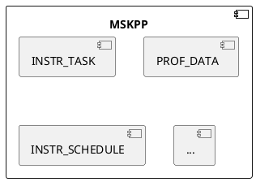

| 分层 | 测试类型 | 测试对象         | 测试价值                         |
| ---- | -------- | ---------------- | -------------------------------- |
| IT   | 组件测试 | `instr_schedule` | 验证指令从创建至调度的核心工作流 |
| UT   | 单元测试 | `prof_data`      | 验证数据构建过程功能正确         |
| UT   | 单元测试 | `metric`         | 验证性能数据生成功能正确         |

##### 4.6.1.5 关键测试技术方案

1. 测试工程设计

    对于指令任务创建Python模块应用HDT-PYTHON，对于指令调度模块应用GTEST与GMOCK。

2. 物理设计

    独立于业务代码目录，并统一UT和IT的测试工程。

    ```text
    mskpp/
    ├── requirements.txt
    ├── mskpp
    └── test
        ├── case
        |   └── test_xxx_normal.py
        └── utils
            ├── __init__.py
            └── test_base.py
    ```

3. 运行环境

    运行依赖Python语言环境，无需额外构建，在MR门禁上也要添加。针对C++模块的UT测试，在构建中增加对测试开源仓的依赖。

4. 测试替身设计

    暂无。

5. DSL设计

    暂无。

6. 数据构造设计

    使用真实的数据来实现组件或者端到端的验收测试。构造与外部实现相同的msKPP-DSL语言来进行指令的任务创建与调度并校验生成数据结果。由于以上过程不存在随机性，因此结果数据可校验。

7. 夹具设计

    用例指令依赖单独分离地输入数据，无需进行夹具设计。

8. 匹配器设计

    暂无。

#### 4.6.2 自动寻优

##### 4.6.2.1 设计目标

本文档用于定义msKPP的开发者测试关键要素模型，作为0层的DT公共设计，包括软件可测试性设计和测试分层策略，其中针对不同的分层，进行DT环境、测试工程设计、基础通用
框架和领域专用框架设计、DFX专项测试等。

##### 4.6.2.2 设计约束

遵从架构设计约束。

##### 4.6.2.3 可测试性设计

自动寻优功能通过Python库接口的形式对外提供，业务上可分为下发代码生成、编译、运行作为基础功能，以及利用基础功能的自动寻优，各个模块通过接口协同配合，不同模块的功能按照架构设计隔离解耦，无相互依赖关系，测试时除自动寻优外，应支持各基础功能的接口独立进行ST测试。

##### 4.6.2.4 分层测试

ST：对code_gen、compile、kernel运行、autotune接口进行端到端集成测试；

UT：在上述接口内部，验证单一函数、类的功能是否符合预期地工作。

| 分层 | 测试类型 | 测试对象             | 测试价值                         |
| ---- | -------- | -------------------- | -------------------------------- |
| ST   | 集成测试 | code_gen()           | 端到端验证代码生成功能           |
| ST   | 集成测试 | compile()            | 端到端验证编译功能               |
| ST   | 集成测试 | kernel()           | 端到端验证kernel运行功能         |
| ST   | 集成测试 | autotune             | 端到端验证自动寻优功能           |
| ST   | 集成测试 | tiling_func             | 端到端验证tiling函数调用功能           |
| ST   | 集成测试 | get_kernel_from_binary             | 端到端验证kernel调用功能           |
| UT   | 单元测试 | 以上接口内部函数、类 | 验证最小实现单元工作是否符合预期 |

##### 4.6.2.5 关键测试技术方案

1. 测试工程设计

    使用pytest进行。

2. 物理设计

    独立于业务代码目录，并统一UT和ST的测试工程。

    ```text
    mskpp/
    ├── requirements.txt
    ├── mskpp
    └── test
        ├── launcher
            ├── test_code_gen_xxx.py
            ├── test_compiler.py
            ├── test_driver.py
        |   └── test_opgen_workflow.py
        ├── op_tune
        |   └── test_autotune_xxx.py
        └── utils
            ├── __init__.py
            └── test_base.py
    ```

3. 运行环境

   运行依赖Python语言环境，无需额外构建，在MR门禁上也要添加。针对C++模块的UT测试，在构建中增加对测试开源仓的依赖。

4. 测试替身设计

   不涉及。

5. DSL设计

   不涉及。

6. 数据构造设计

   使用接口样例作为端到端测试用例，输出结果可预测。

7. 夹具设计

   不涉及。

8. 匹配器设计

   不涉及。

## 5. 运行视图

### 5.1 交互模型

#### 5.1.1 性能建模

##### 5.1.1.1 设计目标

msKPP通过向外提供一系列建模接口用以对昇腾芯片内算子运行进行建模，按照运行顺序包括运行环境构建，指令建模，指令任务创建，指令任务调度，算子建模数据分析等核心环节。

##### 5.1.1.2 设计约束

建模环节应单独且隔离，以指令流转为核心

##### 5.1.1.3 交互模型设计

msKPP指令加载以及调度流程

```plantuml
hide footbox
actor "Actor" as U

activate U

participant "Tensor" as L1
participant "instr_api" as L2
participant "MemoryInstruction" as L3
participant "ComputationInstruction" as L4
participant "InstrTask" as L5
participant "prof_data" as L6
participant "TaskSchedule" as L7

group 处理搬运指令
U->> L1: load tensor
activate L1
L1->> L3: launch
deactivate L1
activate L3
L3->> L5: InstrTask()
deactivate L3
activate L5
L5 -> L6: get time
activate L6
L6 -> L5: cost time
deactivate L6
L5->> L7: add task
deactivate L5
activate L7
end

group 处理计算指令
U->> L2: mmad/vxx
activate L2
L2->> L4: launch
deactivate L2
activate L4
L4 -> L6: get time
activate L6
L6 -> L4: cost time
deactivate L6
L4 ->> L5: InstrTask()
deactivate L4
activate L5
L5 ->> L7: add task
deactivate L5
end

U->> L7: run task
L7 -> L7: task schedule
L7->> U: total duration
@enduml
```

#### 5.1.2 自动寻优

##### 5.1.2.1 设计目标

自动寻优应在用户无感知的情况下并行调用代码生成、编译、运行模块接口。

##### 5.1.2.2 设计约束

不涉及。

##### 5.1.2.3 交互模型设计

自动寻优交互流程：

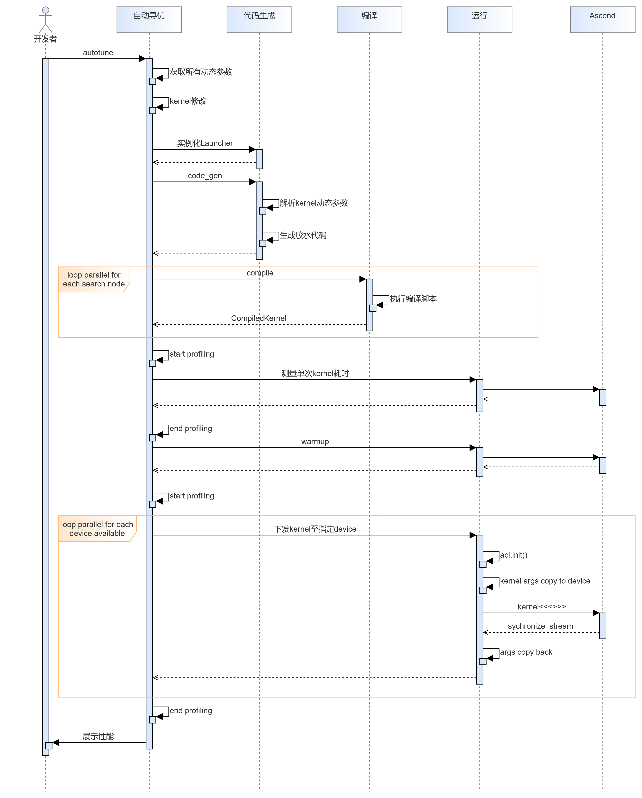

### 5.2 并发模型

#### 5.2.1 性能建模

##### 5.2.1.1 设计目标

msKPP对昇腾芯片上运行的算子进行指令级建模，需要考虑算子实际运行时指令并发的情况。

##### 5.2.1.2 设计约束

msKPP仅需对指令调度的并行特性进行建模，并非实际需要并行，在设计指令调度并行时，如按照软件并发需要考虑CPU和内存的限制避免服务故障。如果只是并发
模拟，需要考虑调度结果的真实有效。

##### 5.2.1.3 并发模型设计

1. 指令调度并发模型

    考虑通过调度并发模拟，将不同pipe指令进行单独建模，在结果上呈现指令并发调度。

2. 备选方案（可选）

    不涉及。

3. 技术决策（可选）

    不涉及。

4. 指令调度并发时序图

    ```plantuml
    hide footbox
    actor "Actor" as U

    activate U

    participant "RawTask" as L1
    participant "TaskGenerator" as L2
    participant "Pipeline" as L3
    participant "TaskSchedule" as L4
    group 指令创建
    U->> L1: add task
    activate L1
    end
    L1->> L2: add task
    activate L2

    group pipeline中添加任务
    L2->> L3
    activate L3
    end

    U->L4: run task
    activate L4
    group 指令划分为active/block
    L4 -> L2 : GetNextPipe()
    end

    L2 -> L2:RefreshPipesStatus
    L2 -> L4:pipesActive.pop()
    group pipe!=nullptr
        L4 -> L3:step
        L3 -> L1:get cutTask
        L1 -> L1:SetDuration
        L1 -> U:RunPreFunc\RunImplFunc\RunPostFunc
        L1 -> L3:update lastExecTime and pipeline block status
        L3 -> L4:totalDuration += lastExecTime
        L4 -> L2:GetNextPipe()
    end
    @enduml
    ```

#### 5.2.2 自动寻优

##### 5.2.2.1 设计目标

自动寻优业务，需保证寻优效率。

##### 5.2.2.2 设计约束

自动寻优存在编译并行与下发并行。

编译流程在CPU，可在所有CPU核上并行。下发流程在神经网络处理单元，为避免性能评估异常，需保证单个device同一时间仅运行一个kernel，可在多device上并行。

##### 5.2.2.3 并发模型设计

每个搜索节点可分解为2个串行任务：编译+下发，编译任务可直接在CPU上多核并行，下发任务

编译后生成的不同kernel放入一个队列中，当有空闲device资源时，从队列中提取一个kernel下发至该device

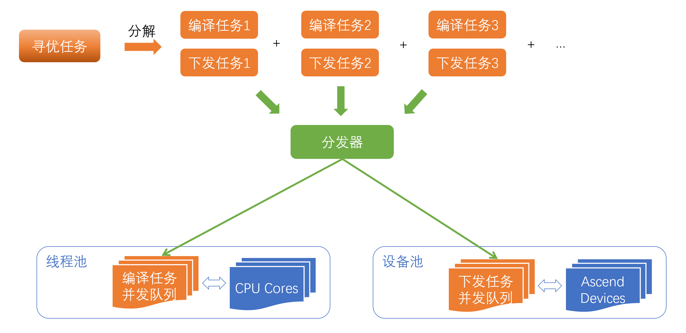

## 6 代码目录结构

```text
├── docs  // 项目文档介绍  
├── mskpp// python代码目录  
│      ├──\_\_init\_\_.py  
│      └── ....  
├── csrc  // CPP源码目录  
│     └── CMakeList.txt  // c代码用的cmake  
├── example  // 工具样例存放目录  
│     └── README.md  // 工具样例说明  
├── setup.py  // 打包脚本  
├── test  // 测试部分，需提供覆盖率统计脚本  
│     └── build_test.py  // 用于进行测试场景的构建，此时不打wheel包  
├── output  // 脚本生成，存放编译生成的交付件  
├── build.py  // 端到端构建脚本  
├── CMakeLists.txt  // 构建总配置  
├── requirements.txt  // python依赖  
└── README.md  // 整体仓代码说明
```
