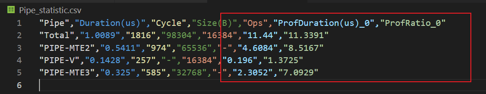
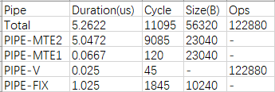
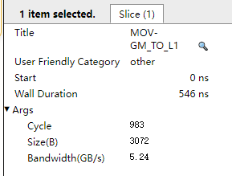

# **MindStudio Kernel Performance Prediction用户指南**


## 简介

MindStudio Kernel Performance Prediction（算子设计工具，msKPP）具有性能建模分析的功能，在算子开发前，可根据算子的数学逻辑作为输入、基于msKPP提供的接口，写出一个算子实现方案的算子表达式，获得该方案的算子性能建模结果。由于本身针对性能的预测不需要进行真实的计算，仅需要依据输入和输出的规模，给出对应算法的执行时间，故而，可以在秒级给出性能建模结果。

## 使用前准备

**环境要求**

进行算子开发之前，需要安装驱动固件和CANN Toolkit软件包以及ops算子包，请参见《CANN 软件安装指南》。本节不再给出安装示例。

请参考环境要求完成相关环境变量的配置，完成后可直接使用msKPP工具的[性能建模功能介绍](#性能建模功能介绍)功能。

> [!NOTE] 说明  
> 如果需要指令占比饼图（instruction_cycle_consumption.html），则需要安装生成饼图所依赖的Python三方库plotly。
> 
>   ```
>   pip3 install plotly
>   ```

**约束**

- 在任意目录下基于msKPP接口进行算子建模，实现中包括如下注意事项：
    - 进行算子建模前，需要导入Tensor、Chip以及算子实现所必要的指令（统一以小写命名）。
    - 以with语句开启算子实现代码的入口，“enable_trace“和“enable_metrics“两个接口可使能trace打点图和指令统计功能，具体请参见[极限性能分析功能介绍](#极限性能分析功能介绍)章节的main.py文件。
    - 算子建模详细指令接口说明请参考《msKPP_API》。

- 二次开发请保证输入数据可信安全。

## 性能建模功能介绍


msKPP为了达到理论性能的目标，基于如下[表1](#111)对实际处理器进行计算和搬运类指令的性能建模。

**表 1**  msKPP建模假设性能<a name="111"></a>

|性能假设|说明|
|--|--|
|内部存储（Local Memory）无限，但用户在生命周期内可用的内存是有限的。|这个假设意味着在实际处理器的建模过程中，不考虑内存容量的限制。这允许用户或开发者可以自由地分配和使用内存资源，而不用担心内存不足的问题。在实际应用中，虽然物理内存是有限的，但这个假设可以简化模型，使得可以专注于其他性能相关的因素。|
|以统计评估的指令能力代表理论性能。|这个假设认为通过对处理器执行指令的统计分析可以得到其理论上的性能表现，处理器在执行指令时的平均性能可以反映出其最高性能潜力。这个假设有助于在设计和优化过程中，通过统计模型预测来提升处理器的性能。|
|下发无瓶颈。|这个假设意味着在数据或指令下发到处理器执行单元的过程中，不会遇到任何瓶颈或限制。也就是说，数据传输和指令调度可以无缝进行，不会因为任何硬件或软件的限制而降低性能。|


- [算子特性建模功能](#算子特性建模功能介绍)

    msKPP支持tensor拆分使用、debug模式和pipe信息的理论值与msprof实测值比对的功能，也支持对算子特性进行建模（搬运通路建模、随路转换建模和cache命中率建模），用户需根据实际需求进行选择。

- [算子计算搬运规格分析功能](#算子计算搬运规格分析功能介绍)

    以matmul算子为例介绍算子计算搬运规格分析功能。

- [极限性能分析功能](#极限性能分析功能介绍)

    以matmul算子为例介绍极限性能分析功能。

- [算子tiling初步设计功能](#算子tiling初步设计功能)

    tiling策略的模拟体现在算子功能函数的for循环中，进行切分时，需确保每次for循环处理的数据量相同。

## 算子特性建模功能介绍

**功能说明**

msKPP支持tensor拆分使用、debug模式和pipe信息的理论值与msprof实测值比对的功能，也支持对算子特性进行建模（搬运通路建模、随路转换建模和cache命中率建模），用户需根据实际需求进行选择，完成后可实现[算子计算搬运规格分析功能介绍](#算子计算搬运规格分析功能介绍)、[极限性能分析功能介绍](#极限性能分析功能介绍)以及[算子tiling初步设计功能](#算子tiling初步设计功能)。

**注意事项**

文档中的Ascend_xxxyy_需替换为实际使用的处理器类型。

**使用示例**

- 支持搬运通路建模（Atlas A2 训练系列产品/Atlas A2 推理系列产品）

    在Atlas A2 训练系列产品/Atlas A2 推理系列产品中，新增了L1到fixpipe buffer(FP)的通路以及L1到Bias table(BT)的通路。前者用于L0C_TO_OUT随路转换时存储量化转换的scale参数，后者用于存储一维的bias数据。在本工具中对该搬运通路建模只需按照GM->L1->FP/BT的顺序即可。

    ```
    in_x = Tensor("GM", "FP16", [64], format="ND")
    l1_x = Tensor("L1")
    fp_x = Tensor("FB")
    bt_x = Tensor("BT")
    l1_x.load(in_x)
    l1_x_to_fp = l1_x[0:32]
    l1_x_to_bt = l1_x[32:64]
    fp_x.load(l1_x_to_fp)
    bt_x.load(l1_x_to_bt)
    ```

- 支持随路转换建模

    在昇腾AI处理器的Cube单元中，进行计算的数据格式需要是特殊的私有NZ格式。而通常在GM上的数据都是ND格式，因此在进行Cube运算时，需要将数据格式进行转换。在Atlas A2 训练系列产品/Atlas A2 推理系列产品中，GM到Cube相关的存储单元的搬运通路已具备ND转NZ的随路转换能力。

    在msKPP工具中，若GM-L1且用户定义GM的tensor是ND，L1的tensor是NZ，或L0C-GM且用户定义L0C上的tensor是NZ，GM的tensor是ND，则开启随路转换，调取相关实测数据。

    ```
    in_x = Tensor("GM", "FP16", [128, 256], format="ND")
    l1_x1 = Tensor("L1", format="NZ")
    l1_x2 = Tensor("L1", format="NZ")
    l1_x1.load(in_x[128, 0:128])
    l1_x2.load(in_x[128, 128:])
    ```

- 支持Cache命中率建模

    L2Cache是指部分GM空间与Vectorcore和cubecore存在高带宽的搬运通路，当L2Cache命中率接近100%与L2Cache命中率接近0%时，带宽能有两倍以上的差距。msKPP工具目前支持用户手动调整L2Cache命中率。

    ```
    with Chip("Ascendxxxyy") as chip:
        config = {"cache_hit_ratio": 0.6}
        chip.set_cache_hit_ratio(config)
    ```

- 支持Tensor拆分使用

    msKPP工具中，Tensor拆分是指将一个大的Tensor用切片的手段生成新的小Tensor，例如：

    ```
    in_x = Tensor("GM", "FP16", [128, 256], format="ND")
    in_x_1 = in_x[128, 0:128]    # 大小1*128
    in_x_2 = in_x[128, 64:]    # 大小1*64
    ```

- 支持debug模式

    该模式可使能用户初步定位算子建模过程中哪个指令的出队入队存在问题，提升与工具开发共同定位的效率，使能方式如下：

    ```
    with Chip("Ascendxxxyy", debug_mode=True) as chip:
    ```

- 支持PIPE信息的理论值与msprof实测值比对

    以Ascend C算子为例，通过--application方式调用msprof，在OPPROF__{timestamp}__XXX目录中输出PipeUtilization.csv文件，并在脚本中使能：

    ```
    with Chip("Ascendxxxyy") as chip:
        chip.enable_metrics()  
        chip.set_prof_summary_path("/home/xx/OPPROF_{timestamp}_XXX/PipeUtilization.csv")
    ```

    生成的Pipe_statistic.csv文件包含“ProfDuration(us)_0“和“ProfRatio_0“两列，其中ProfDuration(us)_0列的取值和PipeUtilization.csv文件中对应的值一致，ProfRatio_0为实测值跟理论值的比值。 ProfRatio是实测值相对理论值的倍数，倍数越大，优化空间越大。

    **图 1**  Pipe_statistic.csv文件  
    

**输出说明**

无

## 算子计算搬运规格分析功能介绍

**功能说明**

本章节以matmul算子为例介绍算子计算搬运规格分析功能。

**注意事项**

文档中的Ascend_xxxyy_需替换为实际使用的处理器类型。

**使用示例**

以matmul算子为例，该用例表示准备处理[160, 240]和[240, 80]的矩阵乘，切割为5个[32, 48]、[48, 16]和[32, 16]的小矩阵做矩阵乘。通过调用msKPP提供的接口实现的main.py脚本样例如下：

```py
from mskpp import mmad, Tensor, Chip
def my_mmad(gm_x, gm_y, gm_z):
    # 矩阵乘的基本数据通路：
    # 左矩阵x：GM-L1-L0A
    # 右矩阵y：GM-L1-L0B
    # 结果矩阵z： L0C(初始化)-GM
    # 样例数学表达式：z = x @ y + b
    # 定义和分配L1上的变量
    l1_x = Tensor("L1")
    l1_y = Tensor("L1")
    # 定义和分配L0A和L0B上的变量
    x = Tensor("L0A")
    y = Tensor("L0B")
    # 定义和分配在L0C上的偏置项，理论上应该分配在累加器Buffer上，分配在L0C不影响性能
    b = Tensor("L0C", "FP32", [32, 16], format="NC1HWC0")
    # 将GM上的数据移动到L1对应内存空间上
    l1_x.load(gm_x)
    l1_y.load(gm_y)
    # 将L1上的左右矩阵移动到L0A和L0B上
    x.load(l1_x)
    y.load(l1_y)
    # 当前数据已加载到L0A和L0B上，调用指令进行计算，结果保存在L0C上，out是mmad函数内部在L0C中分配的变量
    out = mmad(x, y, b, True)()
    # 将L0C上的数据移动到GM变量gm_z的地址空间上
    gm_z.load(out[0])
    return gm_z
if __name__ == '__main__':
    with Chip("Ascendxxxyy") as chip:
        chip.enable_trace() # 使能算子模拟流水图的功能，生成trace.json文件
        chip.enable_metrics() # 使能单指令及分PIPE的流水信息，生成Instruction_statistic.csv和Pipe_statistic.csv文件
        # 模拟一个大矩阵被切分成5个小矩阵进行计算
        for _ in range(5):
            # 应用算子进行AICORE计算
            in_x = Tensor("GM", "FP16", [32, 48], format="ND")
            in_y = Tensor("GM", "FP16", [48, 16], format="ND")
            in_z = Tensor("GM", "FP32", [32, 16], format="NC1HWC0")
            my_mmad(in_x, in_y, in_z)
```

使用Python执行以上main.py脚本后，会在**当前路径/MSKPP**_**TIMESTAMP**_目录下生成搬运流水统计文件（Pipe_statistic.csv）和指令信息统计文件（Instruction_statistic.csv），可查看msKPP建模结果。

> [!NOTE] 说明  
> TIMESTAMP为当前时间戳。

**输出说明**

**搬运流水统计**

搬运流水统计文件**Pipe_statistic.csv**，该文件统计了不同PIPE的总搬运数据量大小、操作数个数以及耗时信息。

**图 1**  Pipe_statistic.csv  


关键字段说明如下。

**表 1**  字段说明

|字段名|字段解释|
|--|--|
|Pipe|表示昇腾处理器中不同PIPE单元的名称。|
|Duration(us)|PIPE耗时，单位us。|
|Cycle|各个指令每次执行时消耗的cycle数。|
|Size(B)|表示搬运类PIPE的搬运量大小，单位B。|
|Ops|表示计算类PIPE的计算元素大小。|


对于流水线耗时最长，明显是搬运性能瓶颈的PIPE，通常有如下优化思路：

- 若搬运数据量较大时，尽可能一次搬运较多的数据，充分利用搬运带宽。
- 尽可能保证性能瓶颈的PIPE在流水上一直在工作。

**指令信息统计**

指令信息统计文件**Instruction_statistic.csv**，该文件统计了不同指令维度的总搬运数据量大小、操作数个数以及耗时信息，能够发现指令层面上的瓶颈主要在MOV-GM_TO_L1（属于PIPE-MTE2），从指令层面找到了性能瓶颈处。

**图 2**  Instruction_statistic.csv  


关键字段说明如下。

**表 2**  字段说明

|字段名|字段解释|
|--|--|
|Instruction|指令名称。|
|Duration(us)|PIPE耗时，单位us。|
|Cycle|各个指令每次执行时消耗的cycle数。|
|Size(B)|表示搬运类PIPE的搬运量大小，单位B。|
|Ops|表示计算类PIPE的计算元素大小。|


## 极限性能分析功能介绍

**功能说明**

本章节以matmul算子为例介绍极限性能分析功能。

**注意事项**

文档中的Ascend_xxxyy_需替换为实际使用的处理器类型。

**使用示例**

以matmul算子为例，该用例表示准备处理[160, 240]和[240, 80]的矩阵乘，切割为5个[32, 48]、[48, 16]和[32, 16]的小矩阵做矩阵乘。通过调用msKPP提供的接口实现的main.py脚本样例如下：

```py
from mskpp import mmad, Tensor, Chip
def my_mmad(gm_x, gm_y, gm_z):
    # 矩阵乘的基本数据通路：
    # 左矩阵x：GM-L1-L0A
    # 右矩阵y：GM-L1-L0B
    # 结果矩阵z： L0C(初始化)-GM
    # 样例数学表达式：z = x @ y + b
    # 定义和分配L1上的变量
    l1_x = Tensor("L1")
    l1_y = Tensor("L1")
    # 定义和分配L0A和L0B上的变量
    x = Tensor("L0A")
    y = Tensor("L0B")
    # 定义和分配在L0C上的偏置项，理论上应该分配在累加器Buffer上，分配在L0C不影响性能
    b = Tensor("L0C", "FP32", [32, 16], format="NC1HWC0")
    # 将GM上的数据移动到L1对应内存空间上
    l1_x.load(gm_x)
    l1_y.load(gm_y)
    # 将L1上的左右矩阵移动到L0A和L0B上
    x.load(l1_x)
    y.load(l1_y)
    # 当前数据已加载到L0A和L0B上，调用指令进行计算，结果保存在L0C上，out是mmad函数内部在L0C中分配的变量
    out = mmad(x, y, b, True)()
    # 将L0C上的数据移动到GM变量gm_z的地址空间上
    gm_z.load(out[0])
    return gm_z
if __name__ == '__main__':
    with Chip("Ascendxxxyy") as chip:
        chip.enable_trace() # 使能算子模拟流水图的功能，生成trace.json文件
        chip.enable_metrics() # 使能单指令及分PIPE的流水信息，生成Instruction_statistic.csv和Pipe_statistic.csv文件
        # 模拟一个大矩阵被切分成5个小矩阵进行计算
        for _ in range(5):
            # 应用算子进行AICORE计算
            in_x = Tensor("GM", "FP16", [32, 48], format="ND")
            in_y = Tensor("GM", "FP16", [48, 16], format="ND")
            in_z = Tensor("GM", "FP32", [32, 16], format="NC1HWC0")
            my_mmad(in_x, in_y, in_z)
```

使用Python执行以上main.py脚本后，会在`当前路径/MSKPP_TIMESTAMP_`目录下生成文件指令流水图（trace.json）和指令占比饼图（instruction_cycle_consumption.html），可查看msKPP建模结果。

> [!NOTE] 说明  
> TIMESTAMP为当前时间戳。

**输出说明**

指令流水图

流水图文件**trace.json**，通过查看该文件可以发现在理想的流水中，性能瓶颈的PIPE-MTE2是需要能够一直进行运转的。

> [!NOTE] 说明 
> 在Chrome浏览器中输入“chrome://tracing“地址，将**.json**文件拖到空白处并打开，通过键盘上的快捷键（W：放大，S：缩小，A：左移，D：右移）进行查看。

**图 1**  trace.json  


单击流水图中的“MOV-GM_TO_L1“单指令，可查看该指令在当前搬运量及计算量下的cycle数和带宽，如[图2](#222)所示。

**图 2**  指令详细信息<a name="222"></a>  


**指令占比饼图**

生成了指令占比饼图**instruction_cycle_consumption.html**，从中可以发现MOV-GM_TO_L1是算子里的最大瓶颈。

**图 3**  指令耗时统计  


## 算子tiling初步设计功能

**功能说明**

tiling策略的模拟体现在算子功能函数的for循环中，进行切分时，需确保每次for循环处理的数据量相同。

**注意事项**

文档中的Ascend_xxxyy_需替换为实际使用的处理器类型。

**使用示例**

以matmul算子为例，该用例表示模拟一个大矩阵被切分成小矩阵进行矩阵乘计算。需根据用户算子逻辑方案实现算子功能函数。tiling策略的模拟体现在算子功能函数的for循环中（以下代码中加粗部分），例如单核处理[160, 240]和[240, 80]的矩阵乘，切割为25个[32, 48]和[48, 16]的小矩阵分批处理，就需要for循环25次并每次创建大小为[32, 48]和[48, 16]的Tensor矩阵（在GM上）。

```py
from mskpp import mmad, Tensor, Chip
def my_mmad(gm_x, gm_y, gm_z):
    # 矩阵乘的基本数据通路：
    # 左矩阵A：GM-L1-L0A
    # 右矩阵B：GM-L1-L0B
    # 结果矩阵C： L0C(初始化)-GM
    l1_x = Tensor("L1")
    l1_y = Tensor("L1")
    l1_x.load(gm_x)
    l1_y.load(gm_y)
    x = Tensor("L0A")
    y = Tensor("L0B")
    x.load(l1_x)
    y.load(l1_y)
    z = Tensor("L0C", "FP32", [32, 16], format="NC1HWC0")
    out = mmad(x, y, z, True)() # 对于输出需要返回传出
    z = out[0]
    return z

if __name__ == '__main__':
    with Chip("Ascendxxxyy") as chip:
        chip.enable_trace()    # 使能算子模拟流水图的功能，生成trace.json文件
        chip.enable_metrics()   # 使能单指令及分Pipe的流水信息，生成Instruction_statistic.csv和Pipe_statistic.csv文件
        # 这里进入了对数据切分逻辑的处理，对一大块GM的数据，如何经过拆分成小数据分批次搬入，如何对
        # 内存进行分片多buffer搬运，都是属于tiling策略的范畴，这里模拟了单buffer情况，
        # 将[160, 240]和[240, 80]的矩阵乘，切割为25个[32, 48]和[48, 16]的小矩阵分批次进行运算的一个tiling策略
        for _ in range(25):
            in_x = Tensor("GM", "FP16", [32, 48], format="ND")
            in_y = Tensor("GM", "FP16", [48, 16], format="ND")
            in_z = Tensor("GM", "FP32", [32, 16], format="NC1HWC0")
            out_z = my_mmad(in_x, in_y, in_z)
            in_z.load(out_z)
```

**输出说明**

无

